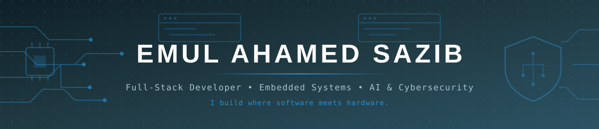
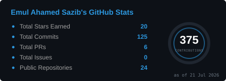
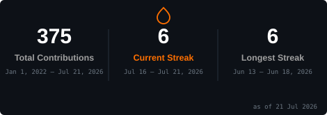
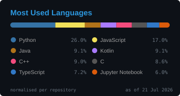
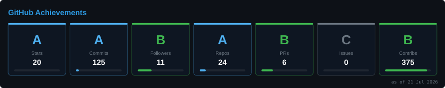
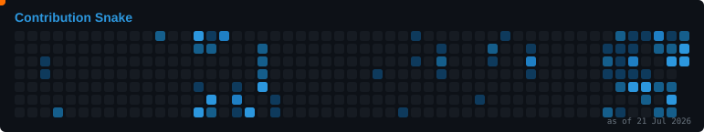

<!--
════════════════════════════════════════════════════════════════════
  ⚠️  ONE-TIME SETUP  ⚠️
  This README defaults your GitHub username to "emulsazib" (from emulsazib.me).
  If your real handle is different, Find-and-Replace "emulsazib" → your-username.
  Also replace the LinkedIn / Twitter / Email placeholders in the "Connect" section.
════════════════════════════════════════════════════════════════════
-->

<!-- ============================ HERO BANNER ============================ -->

<!-- ============================ TYPING SUB-HEAD ============================ -->

<!-- ============================ SOCIAL / STATS BADGES ============================ -->

---

## 🧭 About Me

I'm a **Software Engineer and Electrical & Computer Engineering (ECE) student at North South University, Dhaka**, working at the intersection of **software, hardware, and security**. My focus spans **full-stack web architecture, embedded systems and IoT, and AI-enabled cybersecurity research**.

Whether I'm shipping a **multi-tenant SaaS platform**, modeling a **custom microprocessor datapath**, or designing an **explainable-AI malware-analysis framework**, I care about one thing: **solving hard engineering problems end to end** — from the silicon up to the browser.

- 🎓 **B.Sc. in Electrical & Computer Engineering** — North South University
- 🧩 **Domains:** Full-Stack Development · Embedded Systems / IoT · Cybersecurity · Applied AI/ML · Low-Level Computer Architecture
- 🌍 **Availability:** Open to **remote software, embedded, and AI/security** opportunities
- 💬 **Ask me about:** React, Node.js, Flutter, STM32/ESP32, YOLOv11, malware analysis, LLVM & custom ISAs

---

## 🚀 What I'm Building Right Now

| 🔭 Project | Focus |
|-----------|-------|
| **Rentari.ai** | A property-management platform bridging automated listing metrics with smart-hardware overrides. |
| **AETHER** | An AI-Enabled Framework for **Automated Malware Analysis, Attribution & Explainable AI (XAI)**. |
| **Low-Level Architecture** | Custom **LLVM frontends** and **MIPS datapath simulation** — exploring how compilers meet silicon. |
| **knbase** | Ai agent **memory governance** npm packege  manage memory and share knowledge between ai agents |
| **CombinePro** | A multi agent IDE.  manage all ai agents for specific task in a project |

---

## 🛠️ Tech Stack & Toolbox

### 💻 Full-Stack Development

### 🔩 Embedded Systems & Hardware

-A8B9CC?style=for-the-badge&logo=c&logoColor=black)

### 🛡️ Cybersecurity, AI & Low-Level Architecture

-512BD4?style=for-the-badge&logo=dotnet&logoColor=white)

---

## 📂 Featured Projects

### 🏢 genCRM — Multi-Tenant Real-Time CRM Platform
> A full-stack, **multi-tenant customer-relationship-management** application with **real-time WebRTC communication**, an **Express.js** backend, and a **Flutter web** interface.

`Flutter Web` · `Express.js` · `WebRTC` · `MongoDB` · `Multi-Tenant Architecture`

---

### 🎥 AI-Powered IoT Security System — Edge Vision on ESP32-CAM
> An embedded automation system using an **ESP32-CAM** and a **custom-trained YOLOv11 model** for **real-time violence detection and facial reconstruction** — computer vision running at the edge.

`ESP32-CAM` · `YOLOv11` · `Computer Vision` · `Edge AI` · `Real-Time Inference`

---

### 🧮 Custom 20-Bit MIPS Architecture & Assembler
> A **15-instruction, 20-bit MIPS datapath** designed in **Logisim**, paired with a **custom Python assembler** that validates execution and instruction translation from source to machine code.

`Logisim` · `Computer Architecture` · `Python Assembler` · `Custom ISA` · `Datapath Design`

---

### 🏠 Home Automation Embedded Prototype — STM32 Blue Pill
> A hardware-level automation prototype on the **STM32 Blue Pill** featuring **I2C multi-mode servo triggers**, **environmental thermal thresholds**, and **automated password matching** — all handled directly on the microcontroller.

`STM32` · `I2C` · `HAL in C` · `Sensor Fusion` · `Bare-Metal Firmware`

---

## 📊 GitHub Analytics

<!-- Contribution activity graph -->

---

## 🐍 Contribution Snake

Self-hosted animated snapshot (53 weeks to 21 Jul 2026) — regenerate with <code>python3 scripts/gen_cards.py snake</code>.

---

## 📫 Let's Connect

I'm always open to collaborating on **full-stack, embedded, IoT, or AI-security** projects — or just talking shop about compilers, microcontrollers, and Champions League stats.

<!--
════════════════════════════════════════════════════════════════════
  🐍 CONTRIBUTION SNAKE — now self-hosted (no GitHub Action needed).
  The animation is a static SVG snapshot at assets/snake.svg, generated by
  scripts/gen_cards.py (see scripts/README.md). To refresh it, re-scrape the
  contribution calendar, update the `filled` block + `END` in snake_card(),
  then run:  python3 scripts/gen_cards.py snake
════════════════════════════════════════════════════════════════════
-->
